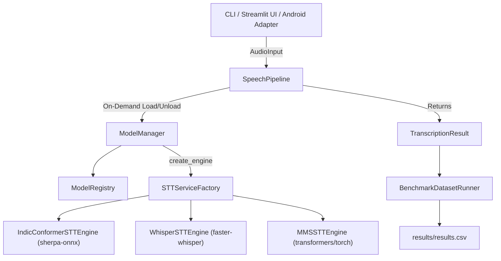

# Offline Speech Communication System - AI Backend Foundation & Multi-Model STT Benchmark

Production-oriented, offline-first AI backend foundation designed for low-connectivity, disaster, and field operations. Features unified STT model adapters, deterministic public dataset benchmarking on **Hindi (`hi`)**, **Tamil (`ta`)**, and **Telugu (`te`)** under **clean** and **noisy** conditions, and an interactive Streamlit UI.

---

## 1. Architecture Overview



### Core Design Principles
- **Decoupled Engine Abstraction**: `BaseSTTEngine` abstract interface isolates core application logic from specific ONNX, C++, PyTorch, or CTranslate2 implementations.
- **Single-Model RAM Discipline**: `ModelManager` retains single-model unloading by default (`load_stt("hi")` automatically frees previously resident models) to guarantee stability on 2–3 GB target edge hardware. Multi-model persistence is opt-in via `benchmark_mode=True`.
- **Pinned CPU Hardware Execution**: All engines enforce CPU-only execution with strictly pinned worker threads (`num_threads` from `configs/default.yaml`) for fair, reproducible latency and RTF comparisons.
- **Reproducible Dataset Benchmarking**: `dataset/manifest.py` deterministically samples from official AI4Bharat/IndicSUPERB Kathbath test splits across clean and noisy conditions.

---

## 2. Directory Structure

```text
sih-itanra-main/
├── src/
│   └── ai_backend/
│       ├── core/
│       │   ├── config.py          # AppConfig, STTModelConfig & YAML loader
│       │   ├── exceptions.py      # AIBackend exception hierarchy
│       │   ├── types.py           # AudioInput & TranscriptionResult DTOs
│       │   └── logging.py         # Standard structured logger
│       ├── models/
│       │   ├── model_metadata.py  # ModelMetadata DTO with runtime & precision
│       │   ├── model_registry.py  # ModelRegistry multi-model & language mapper
│       │   └── model_manager.py   # Memory-aware ModelManager (load/unload)
│       ├── stt/
│       │   ├── base.py            # Abstract BaseSTTEngine interface
│       │   ├── indicconformer.py  # IndicConformerSTTEngine (sherpa-onnx INT8)
│       │   ├── whisper_engine.py  # WhisperSTTEngine (faster-whisper INT8 tiny/small)
│       │   ├── mms.py             # MMSSTTEngine (Meta MMS ASR transformers/torch)
│       │   └── service.py         # STTServiceFactory
│       ├── tts/                   # Reserved for TTS models
│       ├── vad/                   # Reserved for VAD models
│       ├── pipeline/
│       │   └── speech_pipeline.py # SpeechPipeline orchestrator
│       └── benchmark/
│           ├── metrics.py         # WER, CER, RTF, RAM RSS, model size, composite score
│           └── runner.py          # Legacy single-file benchmark runner
├── dataset/
│   ├── manifest.py                # Deterministic Kathbath clean/noisy manifest generator
│   └── manifest.csv               # Standardized evaluation manifest
├── benchmark/
│   └── dataset_runner.py          # Matrix benchmark runner (models × langs × conditions)
├── ui/
│   └── app.py                     # Streamlit interactive UI & Benchmark Dashboard
├── models/
│   ├── stt/                       # IndicConformer ONNX INT8 models (hi, ta, te, en)
│   ├── whisper/                   # Whisper tiny / small CTranslate2 weights
│   └── mms/                       # Meta MMS-1B weights and language adapters
├── scripts/
│   ├── download_models.py         # Automated model downloader
│   ├── transcribe.py              # CLI transcription script
│   └── benchmark.py               # CLI benchmark runner script
├── configs/
│   └── default.yaml               # Central YAML model and system configuration
├── tests/
│   ├── unit/                      # Unit tests (Whisper, MMS, Config, Registry, Manifest)
│   └── integration/               # Integration tests (ModelManager, Pipeline, Runner)
├── results/
│   └── results.csv                # Benchmark output log
├── requirements.txt               # Dependencies
└── README.md                      # Documentation
```

---

## 3. Models Benchmarked & Provenance

| Model | Architecture | Runtime Engine | Precision / Quantization | Parameter Count / Size | Target Focus |
| :--- | :--- | :--- | :--- | :--- | :--- |
| **AI4Bharat IndicConformer** | Conformer-CTC | `sherpa-onnx` | INT8 ONNX | ~120MB | 22 Indic languages |
| **OpenAI Whisper Tiny** | Encoder-Decoder | `faster-whisper` (CTranslate2) | INT8 | ~39M params (~75MB) | Multilingual general baseline |
| **OpenAI Whisper Small** | Encoder-Decoder | `faster-whisper` (CTranslate2) | INT8 | ~244M params (~480MB) | Multilingual general baseline |
| **Meta MMS ASR** | Wav2Vec2-CTC | `transformers` (PyTorch) | FP32 Torch | ~1B params (~3.8GB) | Multilingual (1000+ languages) |

> [!NOTE]
> **Resource Comparison & Precision Context**:
> Model disk size and process RAM comparisons must be contextualized by the runtime and quantization format (`sherpa-onnx INT8` vs `CTranslate2 INT8` vs `PyTorch FP32`). Meta MMS runs at ~1B parameters in FP32 Torch and will naturally occupy more RAM than INT8 quantized models.

> [!IMPORTANT]
> **Whisper Indic Performance Expectation**:
> OpenAI Whisper Tiny and Small models are general multilingual checkpoints trained predominantly on global web corpora. They are not fine-tuned specifically on low-resource Indic corpora; therefore, higher WER on languages like Tamil and Telugu is an expected characteristic of the model and not an integration defect.

> [!NOTE]
> **Energy / Power Measurement Note**:
> Power and energy consumption measurements are intentionally omitted from empirical logs because hardware power estimation counters (such as RAPL on Linux or powermetrics on macOS) are not natively available on the Windows development host. In accordance with zero-assumption principles, numbers are not fabricated.

---

## 4. Installation & Setup

1. **Install dependencies**:
   ```bash
   pip install -r requirements.txt
   ```

2. **Download IndicConformer INT8 ONNX models**:
   ```bash
   python scripts/download_models.py --languages hi ta te
   ```

---

## 5. Dataset Manifest Generation

Generate the deterministic evaluation manifest from official AI4Bharat/IndicSUPERB Kathbath clean and noisy test sets:

```bash
python dataset/manifest.py --samples 5 --seed 42
```

---

## 6. Running Benchmarks

### Execute Full Matrix Benchmark:
```bash
python benchmark/dataset_runner.py --manifest dataset/manifest.csv --results results/results.csv
```

### Transcribe Single Audio File via CLI:
```bash
python scripts/transcribe.py --language hi --audio test_audio/hindi/test01.wav
```

---

## 7. Streamlit Interactive Dashboard

Launch the interactive web application featuring Single Audio Testing and Benchmark Analytics:

```bash
streamlit run ui/app.py
```

### Dashboard Features:
- **Single Test**: Upload an audio file, choose target language (Hindi, Tamil, Telugu), select multiple models, and compare transcripts side-by-side with WER/CER, latency, RTF, RAM, and model size.
- **Benchmark Dashboard**: Interactive visual breakdown of WER, CER, RTF, RAM RSS, clean vs. noisy comparisons, and re-normalized composite weighted efficiency scores.

---

## 8. Running Automated Tests

Execute the complete unit and integration test suite:

```bash
pytest tests/
```

---

## 9. How to Add a New STT Model

To add any new STT engine:

1. **Create the Engine Adapter**:
   Create a new file in `src/ai_backend/stt/<engine_name>.py` subclassing `BaseSTTEngine`:
   ```python
   from ai_backend.stt.base import BaseSTTEngine
   from ai_backend.core.types import AudioInput, TranscriptionResult
   from ai_backend.models.model_metadata import ModelMetadata

   class CustomSTTEngine(BaseSTTEngine):
       def __init__(self, config, num_threads=2):
           self.config = config
           self.num_threads = num_threads

       def load(self): ...
       def unload(self): ...
       def is_loaded(self): ...
       def transcribe(self, audio: AudioInput) -> TranscriptionResult: ...
       def metadata(self) -> ModelMetadata: ...
   ```

2. **Register in Factory**:
   Add the dispatch rule in `src/ai_backend/stt/service.py`:
   ```python
   elif name_lower == "custom_engine":
       return CustomSTTEngine(config=model_config, num_threads=num_threads)
   ```

3. **Declare Configuration in `configs/default.yaml`**:
   ```yaml
   models:
     stt:
       custom_hi:
         name: "custom_engine"
         version: "1.0.0"
         language: "hi"
         path: "models/custom/model.bin"
         quantization: "int8"
         format: "custom"
         architecture: "Custom-ASR"
         runtime: "custom-runtime"
         source: "Community"
         expected_sample_rate: 16000
   ```

4. **Add Unit Test**: Add a test in `tests/unit/test_<engine_name>.py` validating initialization, metadata, and empty input handling.
